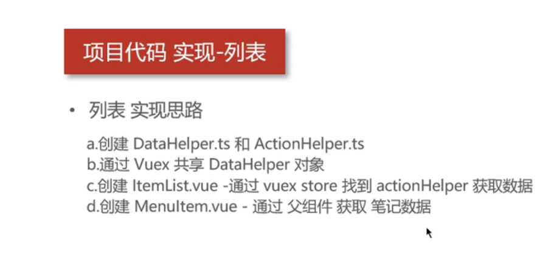
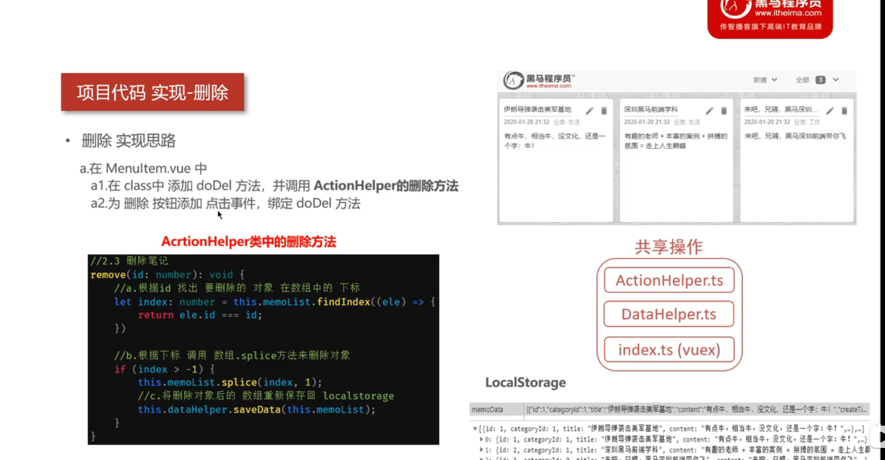

## 学习笔记

## Project setup
```
npm install

npm run serve
```

## 环境

```

npm i -g @vue/cli

vue create demo-name

vue add @vue/typescript(去项目里面敲命令)

npm i vuex


```
<!--  -->

### 关闭eslint


### 模型结构分析



```
1. ItemList 是 MemoItem 列表组合而成的

2. ActionHelper.ts是业务操作

3. DataHelper.ts 是localstorage存放数据

4. Index.ts vuex-状态管理

5. ItemData 是列表项数据

6. CateEnums 是 数据的类型 枚举值
```

### 创建数据模型

1. export default ItemData


2. 赋值


### DataHelper.ts

1. 负责localstorage操作


2. 新增了两个字段：memoData,id

### ActionHelper.ts memoList做处理

1. 将DataHelper.ts 存的数据引进来，并且对引进来的数据进行业务处理。


2. ActionHelper.ts 中的readData()作用：将常见的Object对象转化为ItemData队列


3. 调用，调用的同事就构造了默认结构


4. ActionHelper除了读取还有新增，修改，删除业务。新增方法addData需要重写一下


```
1. a 会返回生成新的Id的对象，保存进本地的 dataHelper中

2. b 将带有Id值的笔记，存入本地的 this.momoList中

3. C 将新的笔记数组 存入localstorage中

4. D 将当前Id值返回回去
```

- 传入当前的 memo Item值，再在ActionHelper做处理。


- 测试


### vuex使用


1. vuex 使用 AxtionHelper,而DataHelper不要直接取引用。因为我们不会直接使用它。而是全局使用AxtionHelper就可以了。

### ItemList

```
1. ItemList 如何显示多少个MemoItem 呢

通过调用 AxtionHelper

2. AxtionHelper 从DataHelper拿到数据

3. AxtionHelper 如何把数据返回给ItemList？

那是通过共享数据vuex拿的


```


1. 初始化数据，就是给ItemList 中memoArr data赋值
 
 调用vuex  state aHepler相当于构造了一个新的对象

2. @prop 应该为ts 语法糖写法，我见过没用语法糖的.子组件


3. 父子组件写法，以及@Component语法糖


4. vuex调用方法，不用dispatch或者commit 就可以与class中ActionHelper联动


### 删除包括页面删除和本地删除





### 新增

- 显示编辑框


### 编辑框回显,存在this.memo里面.页面的data

- 编辑新增


- 创建副本，解除对象的指针 上面方法不好在于编辑的时候就改变了ItemList的数据了，会变得一边改，数据一边变化
为了业务需求，搞个副本，就是编辑改变的时候，ItemList的data没有变化，需要一个中间量

### 如何区分是新建的编辑框（id = -1 ）还是打开已填写好的编辑框(id 不为-1)


### 新增保存还是编辑保存功能


### 过滤不同类别


1. 类别数量


1. 类别数据


